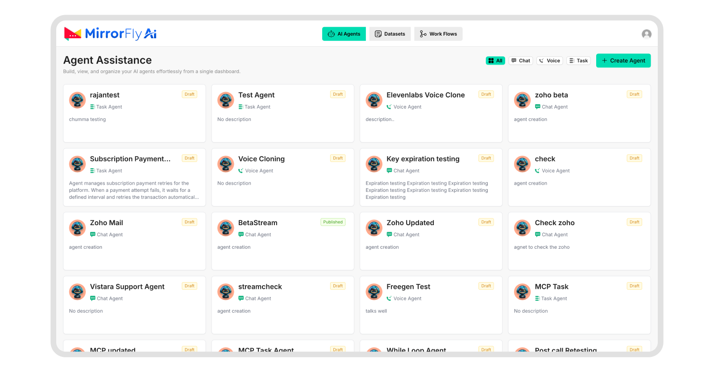
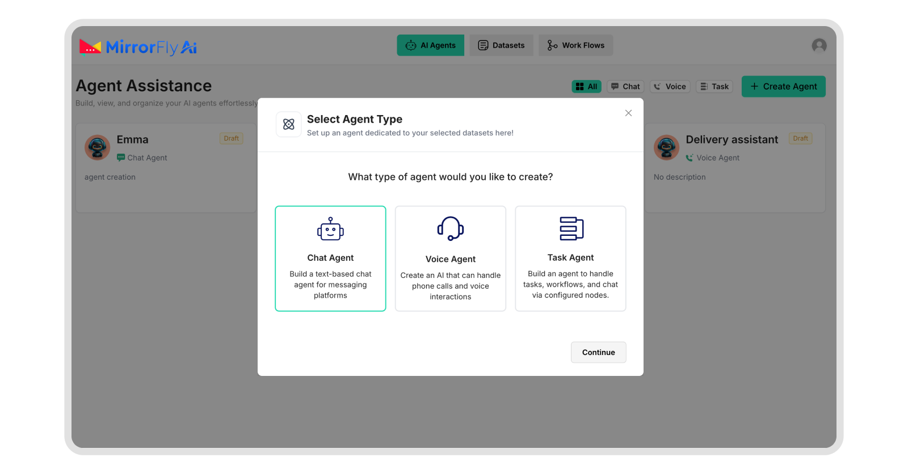
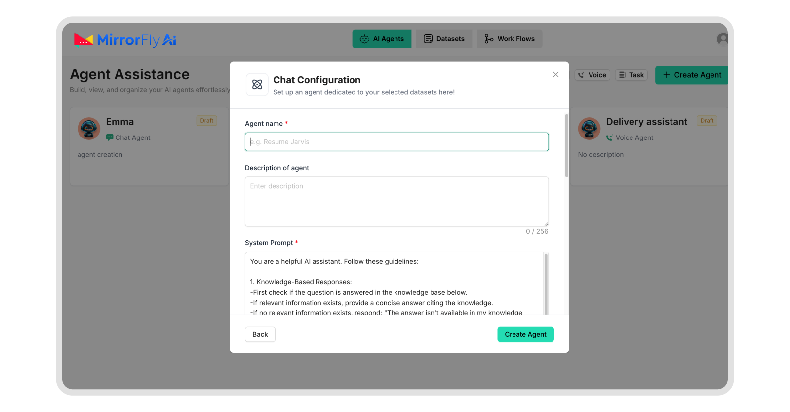
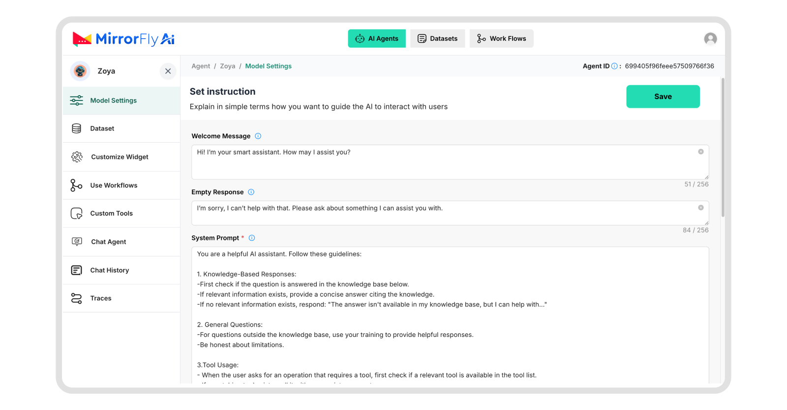
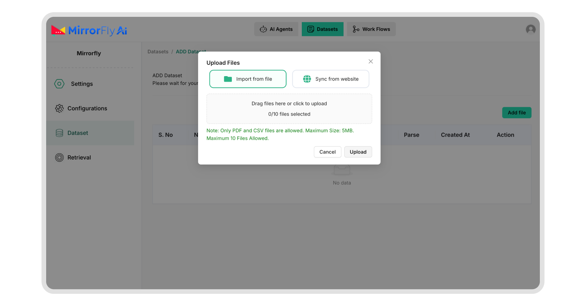

# MirrorFly AI Chat Agent Integration

Build a custom AI chat agent, and integrate it to any platform using the MirrorFly AI-RAG Dashboard, workflow builder and SDK. This white-label AI chatbot solution supports real-time messaging, external knowledge base training (RAG), and SDK documentation. 

## 🚀 Overview

The implementation is divided into two primary phases:

1. **Agent Creation:** Configuring the chat agent’s personality, uploading and training it with datasets, and designing conversation structure using the workflow builder. 

2. **Agent Integration:** Embedding the chatbot into your web app using the MirrorFly AI SDK.


---

## 🛠 Part I: Agent Creation

### 1. Initial Setup

* **Access:** Obtain developer credentials from the MirrorFly team and log into the [MirrorFly AI Dashboard](https://ragchat.contus.us/).



* **Create Agent:** Click **'Create Agents'** and select **'Chat Agent'** and click on **‘Continue’**.



* **Configuration:** Provide an agent name, description, and define the initial **System Prompt** to set core behavior.



### 2. Personality & Model Settings

* **Personality:** Set the welcome message, fallback responses, and adjust the formality and tone.

* **Model Selection:** Choose from multiple available AI models (OpenAI or Anthropic agents)
* **SDK Key**: Create an SDK Key. You’ll need this to connect the chatbot to your web platform.




### 3. Training with RAG (Retrieval-Augmented Generation)

* **Datasets:** Click on the ‘Import from file’ button and select your PDF or CSV files (up to 5MB each, max 10 files) from your local device.

* **Website Sync:** Click on the ‘Sync from website’ to sync business data directly from your website URL.



### 4. Workflow Builder

In the MirrorFly’s node-based workflow builder, design the conversational logic and automate the workflow:

* **Conversation Flow Control:** Use the node-based logic trees to define conditional branching, user intent routing and multi-turn dialogue paths.  
* **API Integration**: Map requests and responses, authenticate headers and error handling for external service calls by configuring the HTTP endpoints.   
* **Form Data Collection:** Implement structured data capture nodes with field validation, type constraints, and conditional field display logic.  
* **Event Triggers:** Configure event-driven actions like email notifications, webhook dispatches, and message queue operations.

Each node supports parameter configuration, variable binding, and connection to downstream nodes, enabling complex workflow orchestration through the drag-and-drop canvas interface.

---

## 💻 Part II: Agent Integration

### **Prerequisites**

* Valid Agent ID   
* Mic access (HTTP-supported website)  
* Latest version of Chrome, Edge, or Safari.


### 1. Install the SDK

Use the below single script tag in your HTML file to add the SDK generated in the dashboard. 
```
<script src="https://d1nzh49hhug3.cloudfront.net/aiVoiceScript/uat/mirrofly/mirror-fly-ai.v1.1.1.js"></script>
```

### 2. Initialize the Agent

Define a container element and initialize the SDK:

```javascript
// HTML Container
<div className="content" id="chatbot-root"></div>

// Initialization
MirrorFlyAi.init({
  container: "#widget",
  agentId: "<YOUR_AGENT_ID>",
  title: "Voice Assistant",
  theme: "dark",
  triggerStartCall: true,
  transcriptionEnable: true,
  transcriptionInUi: true,
  chatEnable: true,
  agentConnectionTimeout: 500
});
```

### 3. Handle Callbacks
```
const callbacks = {
  onTranscription: (data) => console.log("Transcription:", data),
  onAgentConnectionState: (state) => console.log("Connection:", state),
  onError: (error) => console.error("SDK Error:", error)
};
```


### 4. Dynamic Agent Switching

If your platform runs multiple agents (for example, Sales agent and [Custom service agent](https://www.mirrorfly.com/blog/ai-chatbots-for-customer-service/)), use the option below to switch between their contexts.

```javascript
function switchAgent(newAgentId) {
  MirrorFlyAi.destroy();
  document.querySelector("#widget").innerHTML = "";
  MirrorFlyAi.init({
    container: "#widget",
    agentId: newAgentId,
    triggerStartCall: true
  });
}

```


---

## 🛡 Security & Permissions

During initialization, the browser prompts the user to grant microphone access. Be prepared to manage errors using the onError callback, including permission denials or connectivity issues.


## **🤹 Key Product Offerings**

* [Conversational AI Agents](https://www.mirrorfly.com/conversational-ai/)  
* [White-label AI Voice agents](https://www.mirrorfly.com/conversational-ai/voice-agent/)  
* [Custom Chatbots](https://www.mirrorfly.com/conversational-ai/chatbot/)  
* [500+ AI Features](https://www.mirrorfly.com/conversational-ai/features/)  
* [Real-time Chat API](https://www.mirrorfly.com/chat/)  
* [HD Video Call](https://www.mirrorfly.com/video-call-solution.php)  
* [HQ Voice Call](https://www.mirrorfly.com/video-call-solution.php)


## **☁️ Deployment Models \- Self-hosted and Cloud**

MirrorFly offers full freedom with the hosting options:

**Self-hosted:** Deploy your client on your own data centers, private cloud or third-party servers.  
[Check out our multi-tenant cloud hosting](https://www.mirrorfly.com/self-hosted-chat-solution.php)

**Cloud:** Host your client on MirrorFly’s multi-tenant cloud servers.  
[Check out our multi-tenant cloud hosting](https://www.mirrorfly.com/multi-tenant-chat-for-saas.php)


# **📚 Learn More**

* [MirrorFly AI Chatbots](https://www.mirrorfly.com/conversational-ai/chatbot/)  
* [MirrorFly AI Voice Agents](https://www.mirrorfly.com/conversational-ai/voice-agent/)  
* [MirrorFly SDKs](https://www.mirrorfly.com/chat/sdk/)  
* [MirrorFly API Documentation](https://www.mirrorfly.com/docs/)  
* [Product Tutorials](https://www.mirrorfly.com/tutorials/)  
* [See who's using MirrorFly](https://www.mirrorfly.com/chat-use-cases.php)  
* [Tutorial: Build Custom AI Chatbot](https://www.mirrorfly.com/blog/how-to-build-a-custom-ai-chatbot/)  
* [Tutorial: Build Custom LLM Chatbot](https://www.mirrorfly.com/blog/build-custom-llm-chatbot/)  
* [Product Review: AI Chatbots](https://www.mirrorfly.com/blog/best-ai-chatbot/)  
* [Product Review: White-label chat agents](https://www.mirrorfly.com/blog/best-white-label-ai-chatbots/)


# **🧑‍💻 Hire Experts**
Looking for a team to build your AI chatbots and voice agents? [Work with our experts](https://www.mirrorfly.com/hire-video-chat-developer.php) who manage the entire development process and deliver production-ready AI agents built to industry standards.

# **⏱️ Round-the-clock Support**

Need help with our solution? Our experts are [available 24/7](https://www.mirrorfly.com/contact-sales.php) and are always ready to assist you.

## **💼 Become a Part of our amazing team**

Interested in joining our team? We regularly hire developers, support specialists, and product managers. Head to our [careers page](https://www.contus.com/careers.php) to view open roles.

## **🗞️ Get the Latest Updates**

* [Blog](https://www.mirrorfly.com/blog/)  
* [Facebook](https://www.facebook.com/MirrorFlyofficial/)  
* [Twitter](https://twitter.com/mirrorflyteam)  
* [LinkedIn](https://www.linkedin.com/showcase/mirrorfly-official/)  
* [Youtube](https://www.youtube.com/@mirrorflyofficial)  
* [Instagram](https://www.instagram.com/mirrorflyofficial/)
